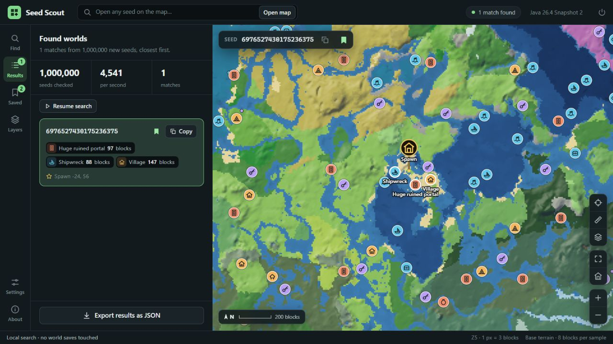

# Seed Scout

Find Minecraft Java seeds with the structures and biomes you want, then explore them on an interactive map. Seed Scout is a Windows desktop app that runs locally and leaves your world saves untouched.

**[Download for Windows](https://github.com/DefamationStation/seed-scout/releases/latest)**

## What it does

- **Find seeds:** combine structures, biomes, distances, counts and exclusions around spawn or custom coordinates. Look for a village near a cherry grove, several ancient cities together, or a fortress near your first Nether portal.
- **Ask for a landscape:** a large plains, flat ground to build on, a hill in reach, a river of a given length, width and straightness, or an island that a river closes right round, in a biome of its own. Results can be ranked by how well they fit.
- **See what comes close:** set a leeway and results that narrowly miss a distance or landscape threshold are listed as close, with what they missed. It tells a search that is too strict from one that cannot be met.
- **Dungeons and amethyst geodes:** predicted by running the game's own placement code on the terrain and carved caves. In a test against a real world, 86% of its dungeons were found at the exact block and 94% of predicted dungeons were real; every geode was found and about 7 in 10 predicted geodes were real. These are slow to search, so they work best with other conditions.
- **Search an existing seed:** find places within one world that match your conditions.
- **Explore the map:** view Overworld terrain, biomes, structures and slime chunks. Inspect locations and copy coordinates or teleport commands.
- **Keep your finds:** save seeds with notes, resume searches, and import or export your rare-find catalogue.

## Get started

1. Install and launch **Minecraft Java 26.4 Snapshot 2** once through the Minecraft Launcher.
2. Install Seed Scout from the download above. Python and Java are included; select your Minecraft folder if prompted.
3. In **Find**, click **Add a condition** and pick what you want. Each condition is one line; click it to set its distance or switch it between **Near** and **Avoid**. Then click **Start searching**. Use **Inside one seed** to search a world you already know.
4. Open a result on the map, then copy its seed into Minecraft's **Create World** screen. You can also enter any numeric seed in the top bar to explore it directly.

## How it works

The desktop app uses a local Python backend and a Java engine compiled against your installed Minecraft version. It calls Minecraft's own biome, terrain and structure-generation code, checking seeds across multiple CPU workers and returning matches that satisfy your conditions. The map samples terrain as you pan and zoom, without generating a complete world.

Built for **Java 26.4 Snapshot 3**, with Snapshot 2 still supported. Other installed vanilla versions can be selected if their world-generation code is compatible. Biome sampling can miss small patches, and the map shows base terrain rather than every finished block, decoration or loot chest. Nether and End structures are supported in seed searches; the map and searches inside one seed currently cover the Overworld.

**Snapshot 3:** Ice Caves can be searched near an origin, linked to structures, excluded, or found inside one seed. They are sampled underground at Y −32, like the other cave biomes; small patches or caves present only at other heights can be missed. Searching for “ice crystals”, “icicles” or “Frostbite” also offers Ice Caves, their habitat. Individual crystals, icicles and dynamically spawning mobs are not separate location markers. The surface map continues to show surface biomes. Biome selection, cave decoration placement sequences and structure checks use the selected snapshot’s native game registries and code.

## Run from source

Requires Python 3, JDK 25 and the Minecraft version above. Set `SEED_SCOUT_JDK` to your JDK folder, then run `python app.py` from this repository. The app opens at `http://127.0.0.1:8877`.

[MIT licence](LICENSE). Minecraft is not included or distributed with Seed Scout.
